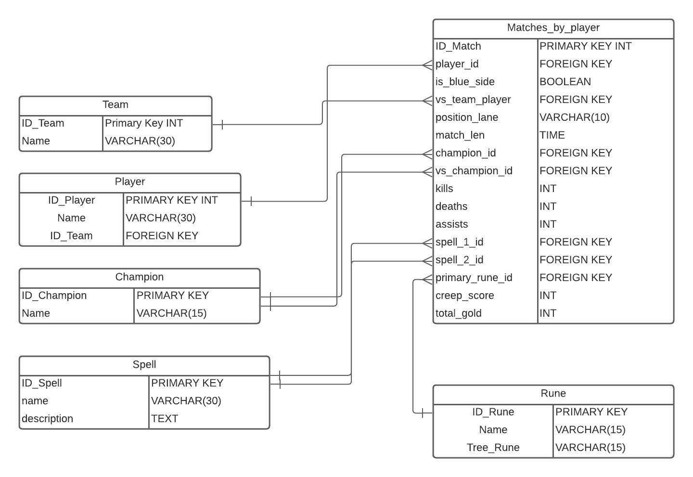

# Projeto - Análise e Extração de Dados - Mundial de League of Legends 2022

<em>A melhor forma de aprender e adquirir experiência é fazendo um projeto de assuntos que gostamos, e para mim `eSports` e `League of Legends` é um dos que mais gosto. </em>

## O que é League of Legends?

League of Legends é um MOBA 5v5, onde 5 jogadores jogam em equipe contra outra equipe de 5 jogadores em que o objetivo das duas equipes é destruir o <em>Nexus inimigo</em>(coração da partida). Para chegar ao Nexus cada jogador tentará: 

* Vencer o jogador inimigo(eliminando-o) e o deixando cada vez mais fraco(fazendo-o perder experiência e ouro)
* Destruir as torres que protegem a base inimiga

A base de uma partida de <em>LoL</em> é ouro e experiência:
* Ouro - faz com que o jogador possa comprar itens e ficar cada vez mais forte
* Experiência - Sobe de nível do personagem, aumentando a força das habilidades e outros atributos do personagem

Com a falta desses componentes é bem provável que o jogador seja eliminado mais vezes e por fim perdendo a partida.

Para conseguir ouro e experiência dentro de uma partida de LoL é necessário:
* <em>Farmar</em> - ato de ganhar ouro e experiência por meio de minions que andam pelo jogo
* Eliminar monstros épicos - Dragão e Barão - Dois monstros que dão mais poder de forças dentro de jogo(seja velocidade de movimento, poder de ataque, durabilidade, maior regeneração de vida). 

É um jogo que tem conquistado o coração de muitos fãs e vem crescendo a cada ano devido a liberdade de que se tem para criar jogadas e estratégias.

## O que é então o Mundial de League of Legends?

O Mundial de League of Legends é um dos maiores eventos(se não o maior) e campeonato de eSports do mundo. 

O evento ocorre sempre no final do ano, agrupando os melhores times de cada região, as maiores e principais sendo China, Coréia do Sul, Europa, Vietnam, Taiwan e Estados Unidos(também conhecidos como Majors). 

É no Mundial que ocorre as melhores partidas, as melhores batalhas, e as melhores viradas. Lá também é onde os players fãs do eSport aprendem novas estratégias, novas mecânicas, novas maneiras de fazer as coisas acontecerem. Todos os times lutam pela taça.

Nesse Mundial, o time da `DRX` levou a melhor contra o time da `T1`. Mas nesse Mundial, como foi a performance de cada jogador? quais foram os personagens que mais trouxeram vitórias para os times? 

É com essa e algumas perguntas que irei extrair, limpar e analisar os dados de `partidas por jogadores` e `partida por campeões` e apresenta-la em um Dashboard utilizando POWER BI

## Sobre o projeto

Nesse projeto vou analisar usando dados extraídos do site: `lol.fandom.com`(conhecido como leaguepedia) utilizando a ferramenta Scrapy. Também fiz o requerimento de dados utilizando o modelo de Diagrama Entidade-Relacionamento no LucidChart - Pois facilita na hora de saber quais dados extrair. 

 
<em>Diagrama de Entidade-Relacionamento(Work in Progress)</em>

## Libs/Tools
* Scrapy
* BeautifulSoup
* Pandas
* Power BI

